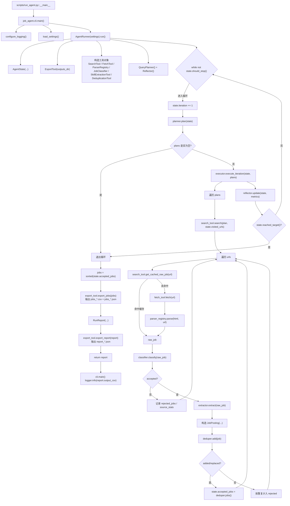

# 从 `run_agent.py` 到导出 CSV：函数级调用流程图

```mermaid
flowchart TD
    A["scripts/run_agent.py::__main__"] --> B["job_agent.cli.main()"]
    B --> B1["configure_logging()"]
    B --> B2["load_settings()"]
    B --> C["AgentRunner(settings).run()"]

    C --> C1["AgentState(...)"]
    C --> C2["ExportTool(outputs_dir)"]
    C --> C3["构造工具对象<br/>SearchTool / FetchTool / ParserRegistry / JobClassifier / SkillExtractionTool / DeduplicationTool"]
    C --> C4["QueryPlanner() + Reflector()"]
    C --> D{"while not state.should_stop()"}

    D -->|进入循环| E["state.iteration += 1"]
    E --> F["planner.plan(state)"]
    F --> G{"plans 是否为空?"}
    G -->|是| O1["退出循环"]
    G -->|否| H["executor.execute_iteration(state, plans)"]

    H --> H1["遍历 plans"]
    H1 --> H2["search_tool.search(plan, state.visited_urls)"]
    H2 --> H3["遍历 urls"]
    H3 --> H4["search_tool.get_cached_raw_job(url)"]
    H4 -->|命中缓存| H7["raw_job"]
    H4 -->|未命中| H5["fetch_tool.fetch(url)"]
    H5 --> H6["parser_registry.parse(html, url)"]
    H6 --> H7

    H7 --> I["classifier.classify(raw_job)"]
    I --> J{"accepted?"}
    J -->|否| K["记录 rejected_jobs / source_stats"]
    J -->|是| L["extractor.extract(raw_job)"]
    L --> M["构造 JobPosting(...)"]
    M --> N["deduper.add(job)"]
    N --> N1{"added/replaced?"}
    N1 -->|是| N2["state.accepted_jobs = deduper.jobs()"]
    N1 -->|否| N3["按重复计入 rejected"]

    K --> H3
    N2 --> H3
    N3 --> H3

    H --> P["reflector.update(state, metrics)"]
    P --> Q{"state.reached_target()?"}
    Q -->|是| O1
    Q -->|否| D

    O1 --> R["jobs = sorted(state.accepted_jobs)"]
    R --> S["export_tool.export_jobs(jobs)<br/>输出 jobs_*.csv + jobs_*.json"]
    S --> T["RunReport(...)"]
    T --> U["export_tool.export_report(report)<br/>输出 report_*.json"]
    U --> V["return report"]
    V --> W["cli.main() logger.info(report.output_csv)"]
```

> 说明：`search_tool.search()` 内部优先走 Board API（Lever/Greenhouse），若无结果再 fallback 到 DuckDuckGo/Bing。
